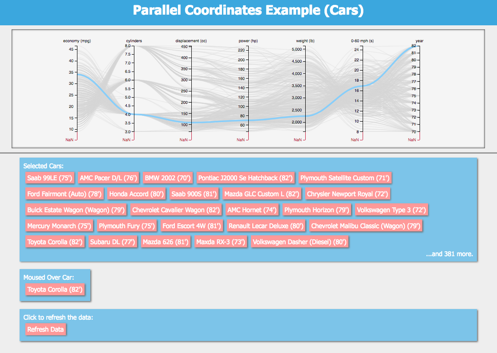
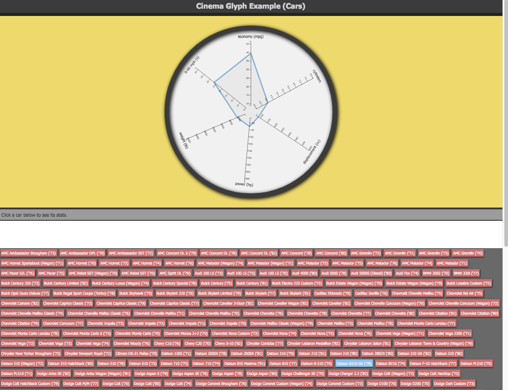

.. _label_cinema_components:

cinema_components Library
=========================

CinemaScience includes a library of viewer components that can be added by the user to create analysis and data specific viewers. These components include:

- **PcoordSVG** -- A component for viewing and browsing a database on a Parallel Coordinates Chart (rendered with SVG).
- **PcoordCanvas** -- A component for viewing and browsing a database on a Parallel Coordinates Chart (rendered with Canvas).

- **Glyph** -- A component for viewing data on a Glyph Chart.

- **ImageSpread** -- A component for viewing image data for a set of data points.

- **Query** -- A component that provides an interface for defining a custom data point and querying the database for similar points.

- **ScatterPlotSVG** -- A component for viewing data on a Scatter plot (rendered with SVG).
- **ScatterPlotCanvas** -- A component for viewing data on a Scatter plot (rendered with Canvas).

Example Use Case
^^^^^^^^^^^^^^^^

Cinema viewers are JavaScript/HTML/CSS based and use D3 to link data and user actions.  Below is a simple example of a browser page that uses a pcoordSVG component to control the display of an ImageSpread component for a database name **mydata.cdb** located in the same directory:

.. code:: HTML

  <html>
    <head>
	   <!--Import D3-->
	     
	   <!--Import Cinema Components Library-->
	    
	   <!--Include Component's CSS-->
	    <link rel='stylesheet' href='css/CinemaComponents.min.css'>
    </head>
    <body>
	   <!--The component will be placed inside container-->
	    

	    

	    
    </body>
  </html>

Full details on the use of cinema_components is on the `cinema_components GitHub`_ page.  

.. _cinema_components GitHub : https://github.com/cinemascience/cinema_components
