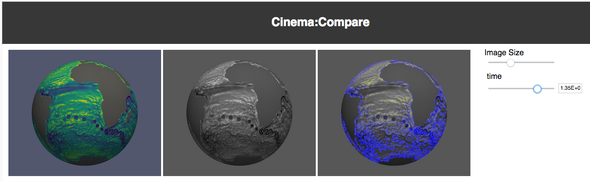

.. _label_cinema_lib:

cinema_lib Library
==================

*Cinema_lib* is a set of tools and a library for interacting with Spec A and Spec D Cinema databases (CDBs) through Python and the command line tool, *cinema*.

Requirements
------------

Minimum Requirements are:

- Python 3.6

Optional requirements are:

- numpy >=1.13
  - image capabilities
  - OpenCV capabilities

- scikit-image >=0.13.1 (newer versions may cause regression tests to fail
  due to changing numerics and implementations of algorithms)
  - image capabilities

- opencv-python >=3.4 (newer versions may cause regression tests to fail
  due to changing numerics)
  - OpenCV capabilities

Installation
------------
To run the command line tool directly from the repository, first clone from the `CinemaScience GitHub`_:

.. code:: bash

  $ git clone https://github.com/cinemascience/cinema_lib.git
  $ cd cinema_lib
  $ ./cinema

Or install with **pip**:

.. code:: bash

  $ git clone https://github.com/cinemascience/cinema_lib.git
  $ cd cinema_lib
  $ pip install .
  $ cinema

Commands
--------

*cinema_lib* provides database manipulation commands, image manipulation commands and computer vision techniques.  Many of these actions result in a the generation of a modified or a new CDB.

Help Command
^^^^^^^^^^^^

- List all of the currently implemented commands.  The abbreviated help header is shown:

.. code:: bash

  $ cinema --help

  usage: cinema [-h] [--version] [-v] [-q] [-a DB] [-d DB] [-l STR] [-t] [-i]
                [--a2d] [--d2s] [--s2d DB] [--image-grey N] [--image-mean N]
                [--image-stddev N] [--image-unique N] [--image-entropy N]
                [--image-joint N] [--image-canny N] [--image-firstq N]
                [--image-secondq N] [--image-thirdq N] [--image-90th N]
                [--image-95th N] [--image-99th N] [--cv-grey N]
                [--cv-box-blur N] [--cv-gaussian-blur N] [--cv-median-blur N]
                [--cv-bilateral-filter N] [--cv-canny N]
                [--cv-contour-threshold N] [--cv-fast-draw N] [--cv-sift-draw N]
                [--cv-surf-draw N]

Examples: Database Manipulation
^^^^^^^^^^^^^^^^^^^^^^^^^^^^^^^

- Validate a Spec A/D database:

.. code:: bash

  Spec A:
  $ cinema -t -a path_to_database/database_name.cdb

  Spec D:
  $ cinema -t -d path_to_database/database_name.cdb

- Return the header (column labels) for a Spec D database:

.. code:: bash

    $ cinema -i -d path_to_database/database_name.cdb

- Validate a Spec D database quickly (without validating the row data), reporting the header verbosely:

.. code:: bash

    $ cinema -itvq -d path_to_database/database_name.cdb

- Validate a Spec A and then convert it to a Spec D database (this will result in the generation of the required **data.csv** file):

.. code:: bash

    $ cinema -t --a2d -a path_to_database/database_name.cdb

Image Color Conversion and Statistics
^^^^^^^^^^^^^^^^^^^^^^^^^^^^^^^^^^^^^

- Convert RGB images in a Spec D database to greyscale images:

.. code:: bash

    $ cinema -d path_to_database/database_name.cdb  --image-grey 2

Using :ref:`label_cinema_view`, one can see that the original Viridis colormap has been converted to greyscale:

.. _CinemaScience GitHub : https://github.com/cinemascience

Let's look at a sample workflow using an MPAS-Ocean static (no rotation) CDB with 173 time steps to perform some image-based analysis.  The workflow starts with validating the database and checking the location of the image FILE column:

.. code:: bash

  $ cinema -itv -d mpas_static.cdb
  INFO: Checking database "mpas_static.cdb" as Spec D.
  INFO: Opening CSV file "data.csv".
  INFO: Header is ('time', 'FILE').
  INFO: Number of columns are 2.
  INFO: First data row is ('0.00E+00', 'image/0.000000e+00.png').
  INFO: Data types are ('FLOAT', 'STRING').
  INFO: FILE column indices are [1].
  INFO: Number of data rows are 173.
  INFO: 173 files validated to be present.
  INFO: Check succeeded.
  0: time
  1: FILE

Note that the FILE column is N=1.  Let's convert the original Viridis colormap to greyscale:

.. code:: bash

  $ cinema -d mpas_static.cdb --image-grey 1

and do a quick validation to verify the new image FILE column:

.. code:: bash

  $ cinema -itvq -d mpas_static.cdb
  INFO: Checking database "mpas_static.cdb" as Spec D.
  INFO: Opening CSV file "data.csv".
  INFO: Header is ('time', 'FILE', 'FILEimage greyscale').
  INFO: Number of columns are 3.
  INFO: First data row is ('0.00E+00', 'image/0.000000e+00.png', 'image/0.000000e+00_image_grey.png').
  INFO: Data types are ('FLOAT', 'STRING', 'STRING').
  INFO: FILE column indices are [1, 2].
  INFO: Doing a quick check. Not checking row data.
  INFO: Check succeeded.
  0: time
  1: FILE
  2: FILEimage greyscale

Choose the new **FILEimage greyscale** image column and calculate the mean image data:

.. code:: bash

    $ cinema -d mpas_static.cdb --image-mean 2

Note that each image action may result in one or more columns of output data being added to the **data.csv** file so validation is a useful step to keep in mind.

The full list of image operations is:

.. code:: bash

  --image-grey N      COMMAND: convert and write image data to greyscale PNG
                      in column number N, using scikit-image color.rgb2grey.
                      New image files are named
                      "<old_base_filename>_image_grey.png"
  --image-mean N      COMMAND: add image mean data calculated from images in
                      column number N
  --image-stddev N    COMMAND: add image standard deviation data calculated
                      from images in column number N
  --image-unique N    COMMAND: add unique pixel count data calculated from
                      images in column number N
  --image-entropy N   COMMAND: add image Shannon entropy data calculated
                      from images in column number N, using a histogram with
                      131072 bins
  --image-joint N     COMMAND: add the joint entropy (multi-dimensional
                      Shannon entropy) data calculated from images in column
                      number N, using 1024 discretization levels per
                      dimension
  --image-canny N     COMMAND: add Canny edge pixel count data calculated
                      from images in column number N
  --image-firstq N    COMMAND: add the first quartile data calculated from
                      images in column number N
  --image-secondq N   COMMAND: add the second quartile data calculated from
                      images in column number N
  --image-thirdq N    COMMAND: add the third quartile data calculated from
                      images in column number N
  --image-90th N      COMMAND: add the 90th percentile data calculated from
                      images in column number N
  --image-95th N      COMMAND: add the 95th percentile data calculated from
                      images in column number N
  --image-99th N      COMMAND: add the 99th percentile data calculated from
                      images in column number N

Computer Vision Commands
^^^^^^^^^^^^^^^^^^^^^^^^

In addition to standard image operations and statistics, *cinema_lib* includes a set of Computer Vision commands.  As an example, one can find features identified by a FAST algorithm.  Let's start with the original MPAS images:

.. code:: bash

    $  cinema -itv -d mpas_static.cdb
    INFO: Checking database "mpas_static.cdb" as Spec D.
    INFO: Opening CSV file "data.csv".
    INFO: Header is ('time', 'FILE').
    INFO: Number of columns are 2.
    INFO: First data row is ('0.00E+00', 'image/0.000000e+00.png').
    INFO: Data types are ('FLOAT', 'STRING').
    INFO: FILE column indices are [1].
    INFO: Number of data rows are 173.
    INFO: 173 files validated to be present.
    INFO: Check succeeded.
    0: time
    1: FILE

First use a *cinema_lib* function to convert the Viridis colormap to greyscale and then run the *cinema* cv-fast-draw option:

.. code:: bash

    $ cinema -d mpas_static.cdb --cv-grey 1
    $ cinema -d mpas_static.cdb --cv-fast-draw 2 --label FAST

Once again, using :ref:`label_cinema_view`, one can see the original Viridis colormap, its greyscale counterpart, and the FAST features added from the Computer Vision suite of functionality.  The FAST algorithm finds the eddies, land masses, and ocean currents:

The full list of computer vision operations is:

.. code:: bash

   --cv-grey N           COMMAND: convert and write image data to greyscale PNG
                         in column number N, using OpenCV cvtColor. new files
                         are named "<old_base_filename>_cv_grey.png"
   --cv-box-blur N       COMMAND: apply box blur to image data in column number
                         N. new files are named
                         "<old_base_filename>_cv_box_blur.png"
   --cv-gaussian-blur N  COMMAND: apply Gaussian blur to image data in column
                         number N. new files are named
                         "<old_base_filename>_cv_gaussian_blur.png"
   --cv-median-blur N    COMMAND: apply median blur to image data in column
                         number N. new files are named
                         "<old_base_filename>_cv_median_blur.png"
   --cv-bilateral-filter N
                         COMMAND: apply bilateral filter to image data in
                         column number N. new files are named
                         "<old_base_filename>_cv_bilateral_filter.png"
   --cv-canny N          COMMAND: apply Canny edge detector to image data in
                         column number N. new files are named
                         "<old_base_filename>_cv_canny.png"
   --cv-contour-threshold N
                         COMMAND: draw contours around image thresholds on
                         image data in column number N. new files are named
                         "<old_base_filename>_cv_contour_threshold.png"
   --cv-fast-draw N      COMMAND: draw FAST features on image data in column
                         number N. new files are named
                         "<old_base_filename>_cv_fast_draw.png"
   --cv-sift-draw N      COMMAND: draw SIFT features on image data in column
                         number N. new files are named
                         "<old_base_filename>_cv_sift_draw.png"
   --cv-surf-draw N      COMMAND: draw SURF features on image data in column
                         number N. new files are named
                         "<old_base_filename>_cv_surf_draw.png"

.. toctree::
   :maxdepth: 2
