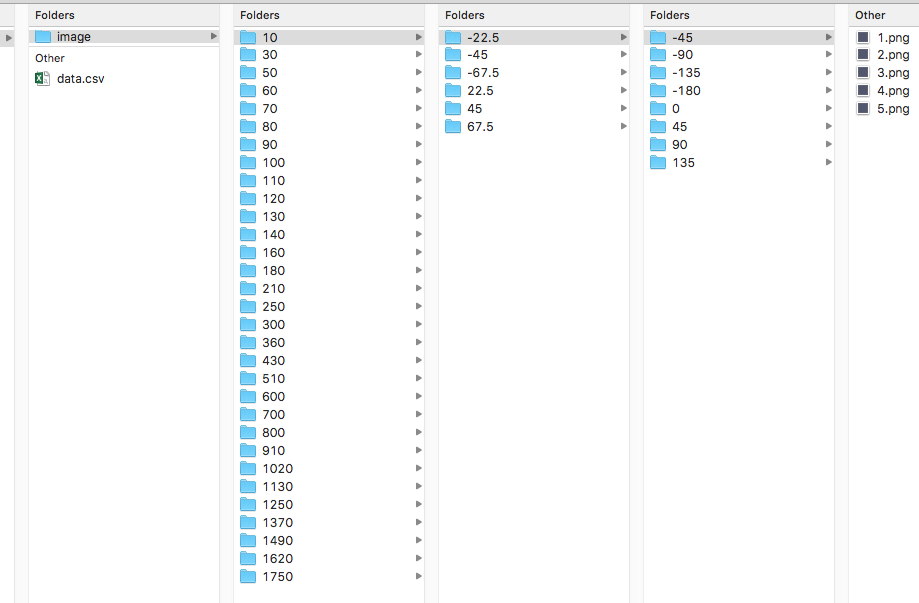

.. _label_specD:

Spec D: Dietrich specification
==============================

The early Cinema specifications focussed on an image-based approach.  The philosophy of Spec D embraces a wide range of data abstracts to leverage and promote data analysis in addition to visualization.  This is a brief overview of the Spec D specifications and we encourage the reader to consult the full document: `Dietrich (Spec D)`_.

Spec D is based on a Comma Separated Values (CSV) database file.  A Cinema database is a directory with a name of the form *database_name.cdb* that contains a **data.csv** file:

The *database_name.cdb* directory may optionally contain other data files references by **data.csv** or may contain optional directories.  An **image/** directory is a common subdirectory to contain rendered images.

.. code:: bash

  $ ls -l sphere.cdb
      ... image                 # a directory for images
      ... data.csv

The first row of the **data.csv** file is a required row of unique non-empty strings that are the column headers for each column.  Each column is a data abstract -- a variable, parameter, (optional) image file, or (optional) data file such as a vti file, or a csv file.  All data values must be floats, integers, strings, or empty (missing) values and must have the same values for all rows of that column (except when empty).

The last header values may either be **FILE** or start with **FILE** (e.g., **FILE,FILE1,FILE2**). No other non-FILE columns may be placed after the first **FILE** column (**FILE** columns are always last).

Each row after the header is a data row.  At least one data row must exist.  The first non-empty value in each column establishes the data type.  The database can be extended simply by appending the **data.csv** file.

A data value representing a file path must be a string containing either a) a POSIX file path, or b) a URL.  Files can be of any type, as indicated by MIME name extension, e.g., .png, .vti, .txt, etc.

Example: Nyx Cosmology Simulation
---------------------------------

This example shows the header row and first few rows of the **data.csv** file for a Nyx Cosmology simulation.  The images show dark matter density for 31 time steps, 6 phi values, 8 theta values and 5 density isosurfaces.   The  columns include variables that define the image: time, phi, theta, and iso, along with data derived from the simulation or from the images themselves: entropy, sample number, Hu moments and a Canny edge calculation.  The last column (FILE) points to the image described by that row.

::

  phi,theta,iso,time,sample,entropy,canny,hu0,hu1,hu2,hu3,hu4,hu5,hu6,FILE
  -180,-67.5,1,10,2486,0.008196755,420,0.485110902,1.28E-07,1.04E-07,3.82E-09,-7.62E-17,1.37E-12,-9.95E-19,image/10/-67.5/-180/1.png
  -135,-67.5,1,10,7054,0.008344357,464,0.485084112,1.48E-07,1.14E-07,7.26E-09,-2.09E-16	2.80E-12,-7.60E-18,image/10/-67.5/-135/1.png
  -90,-67.5,1,10,238,0.008164505,385,0.485064888,1.08E-07,7.63E-08,9.75E-09,-2.66E-16,3.20E-12,-1.43E-18,image/10/-67.5/-90/1.png
  -45,-67.5,1,10,4928,0.007957556,449,0.485064602,1.05E-07,7.44E-08,9.67E-0,-2.59E-16,3.13E-12,-2.23E-18,image/10/-67.5/-45/1.png

The file structure for the images is thus arranged by time step then phi then theta and finally has the images for each of the five density isosurfaces:

   An example of the file system organization for a large Cinema image database (from left to right): top .cdb directory, time steps, phi, theta and isosurfaces.

The Cinema:View and Cinema:Explorer viewers are the basic viewers used with Cinema databases, :ref:`label_viewers`:.  The viewers are based on Spec D and provide the user with different approaches to viewing and exploring the data.  The user is free to develop other viewers and analysis approaches specific to their data.  The `CinemaScience Github`_ contains several repositories to support users in developing their own Cinema viewers.  An example using the Cinema\:Explorer viewer is shown in :ref:`label_cinema_explorer`.

.. _Dietrich (Spec D) : https://github.com/cinemascience/cinema/blob/master/specs/dietrich/01/cinema_specD_v012.pdf
.. _CinemaScience Github : https://github.com/cinemascience

.. toctree::
   :maxdepth: 2
