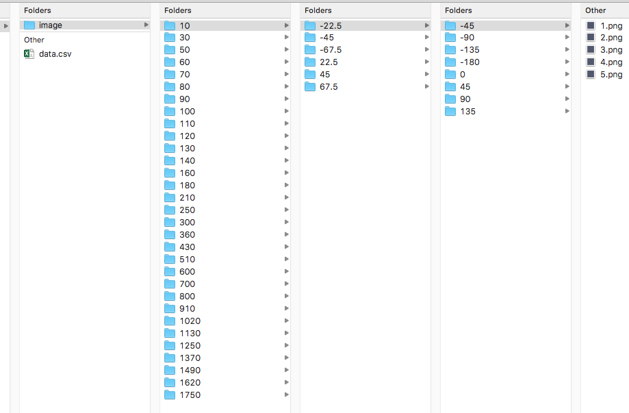

Spec D: Dietrich specification
==============================

The early Cinema specifications focussed on an image-based approach.  The philosophy of Spec D embraces a wide range of data abstracts to leverage and promote data analysis in addition to visualization.

Spec D is based on a Comma Separate Values (CSV) database file.  The first row of the data.csv file is a required row of column headers that are the labels for each column.  Each column represents a data abstract or an (optional) data file such as an image file, vti file, or csv file.  Each row after the header is a data row.  The first non-empty value in each column establishes the data type.  Null and empty values are allowed.  The database can be extended simply by appending the data.csv file.

The additional data files can be of any type, where the format is indicated by MIME name extension.

The Cinema:Explorer Viewer, developed in conjunction with Spec D, provides a parallel coordinate and scatterplot analysis approach.  The user is free to develop other viewers and analysis approaches specific to their data.  The `CinemaScience Github`_ contains several repositories to support users in developing their own Cinema viewers.

Detailed Spec D information, in particular the requirements for the data.csv file, can be found in the official write-up: `Dietrich (Spec D)`_.

Example: Nyx Cosmology Simulation
---------------------------------

This example is the header row and first few rows of the data.csv file for a Nyx Cosmology simulation.  The images show dark matter density for 31 time steps, 6 phi values, 8 theta values and five density isosurfaces.   The data columns include the parameters that define the image: time, phi, theta, and iso along with data derived from the simulation or from the images themselves: entropy, sample number, Hu moments and a Canny edge calculation.  The last column (FILE) points to the image described by that row.

::

  phi,theta,iso,time,sample,entropy,canny,hu0,hu1,hu2,hu3,hu4,hu5,hu6,FILE
  -180,-67.5,1,10,2486,0.008196755,420,0.485110902,1.28E-07,1.04E-07,3.82E-09,-7.62E-17,1.37E-12,-9.95E-19,image/10/-67.5/-180/1.png
  -135,-67.5,1,10,7054,0.008344357,464,0.485084112,1.48E-07,1.14E-07,7.26E-09,-2.09E-16	2.80E-12,-7.60E-18,image/10/-67.5/-135/1.png
  -90,-67.5,1,10,238,0.008164505,385,0.485064888,1.08E-07,7.63E-08,9.75E-09,-2.66E-16,3.20E-12,-1.43E-18,image/10/-67.5/-90/1.png
  -45,-67.5,1,10,4928,0.007957556,449,0.485064602,1.05E-07,7.44E-08,9.67E-0,-2.59E-16,3.13E-12,-2.23E-18,image/10/-67.5/-45/1.png

The file structure for the data images is thus arranged by time step then phi then theta and finally has the images for each of the five density isosurfaces:

This data.csv and image database can be viewed and explored with one of the Cinema viewers.

.. _Dietrich (Spec D) : https://github.com/cinemascience/cinema/blob/master/specs/dietrich/01/cinema_specD_v012.pdf
.. _CinemaScience Github : https://github.com/cinemascience

.. toctree::
   :maxdepth: 2
