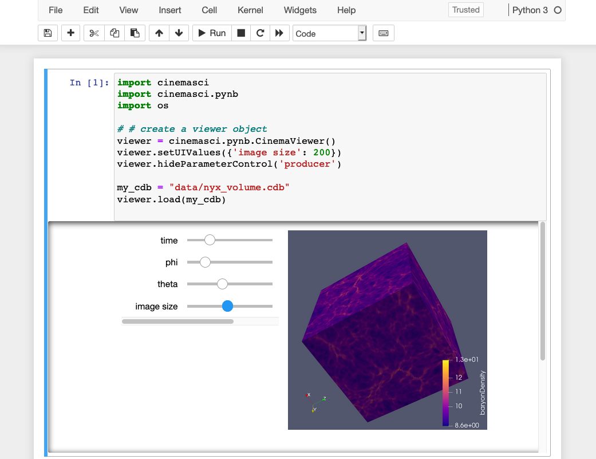
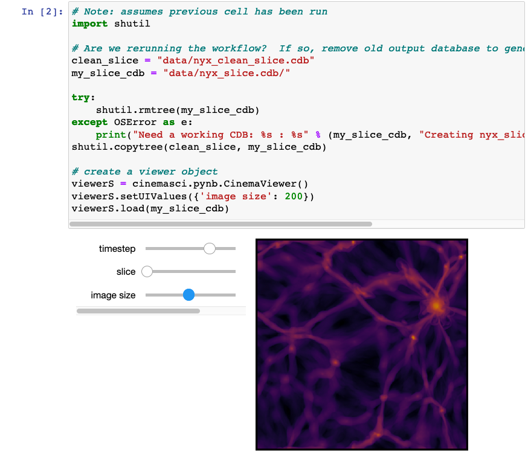
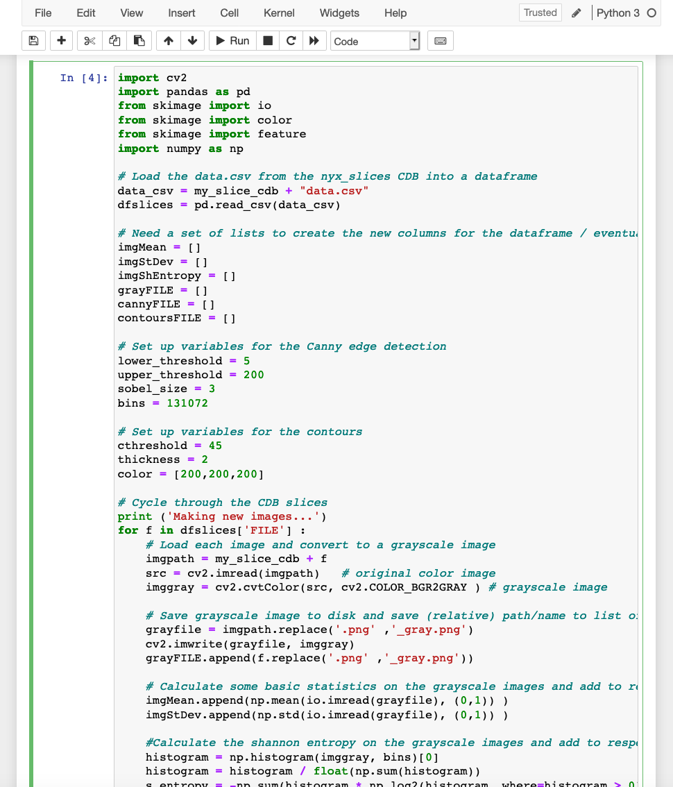
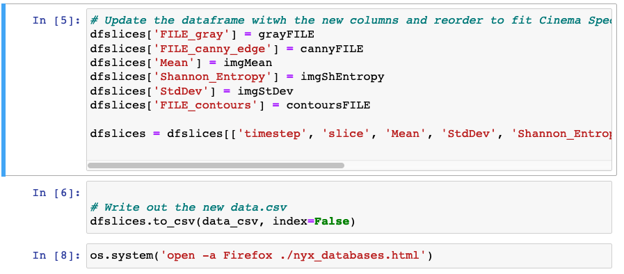

.. _label_tutorial_cinemasci:

Tutorial: Cinemasci
===================

This tutorial uses the `Supercomputng Cinema tutorial`_.

The jupyter notebook workflow needs the following installed:

  * ``Python 3.7`` or above
  * ``pandas``, ``numpy``
  * ``os``, ``shutil``
  * ``cinemasci v1.4``
  *  ``openCV 4.4`` (``opencv-python``)
  * ``skimage`` (``scikit-image``)
  * ``notebook``, ``jupyterLab``

  Start by cloning the full tutorial repository and navigating to the pngviewer subdirectory:

  .. code:: bash

    $ git clone https://github.com/cinemascience/cinema_tutorial_2020-SC
    $ cd cinema_tutorial_2020-SC/cinema_jnc/pngviewer
    $ jupyter notebook

In the jupyter notebook, open ``cinema_tutorial.ipynb``.  The first cell, :numref:`fig_jncViewNyx` uses cinemasci to load a  volume Cinema database from the `Nyx`_ cosmology simulation show the formation of dark matter halos in the universe over time.  The sliders can be used to select the phi and theta view angles and to explore the database over time.

    The first cell in the jupyter notebook workflow creates a Cinema viewer object and loads a Nyx volume database.

The second cell loads a Cinema database with two slices of the Nyx simulation (denoted 7 and 12) over 18 time steps, :numref:`fig_jncSlicesNyx`.

    The second cell in the jupyter notebook workflow creates a Cinema viewer object and loads a Nyx database with two slices of the Nyx simulation.

The next cell, :numref:`fig_jncAnalysis`, runs an image-based analysis using the Python libraries, OpenCV and skimage.  The Cinema database CSV file is loaded into a pandas dataframe for easy manipulation.  The image statistics and  output image names are saved into new lists.

    An example analysis cell that calculates image statistics and finds contours in the Nyx image database.

Finally, :numref:`fig_jncFinish`, the image statistics and output images names are added to the original dataframe and reordered per :ref:`label_specifications` to create the new Cinema database.  The workflow finishes by launching a HTML file in the browser to view the databases in the workflow.

    The new dataframe is written to a CSV file to create the updated Cinema database.

    .. note::

      To use browser based viewers, you need to allow local file access.  See :ref:`label_browser_security` for more information.

The `CinemaScience GitHub`_ page and the `CinemaScience website`_ are useful sources for more information and ideas.

.. _CinemaScience GitHub : https://github.com/cinemascience
.. _CinemaScience website : https://cinemascience.github.io
.. _Supercomputng Cinema tutorial : https://github.com/cinemascience/cinema_tutorial_2020-SC
.. _Nyx : https://iopscience.iop.org/article/10.1088/0004-637X/765/1/39

.. toctree::
   :maxdepth: 2
