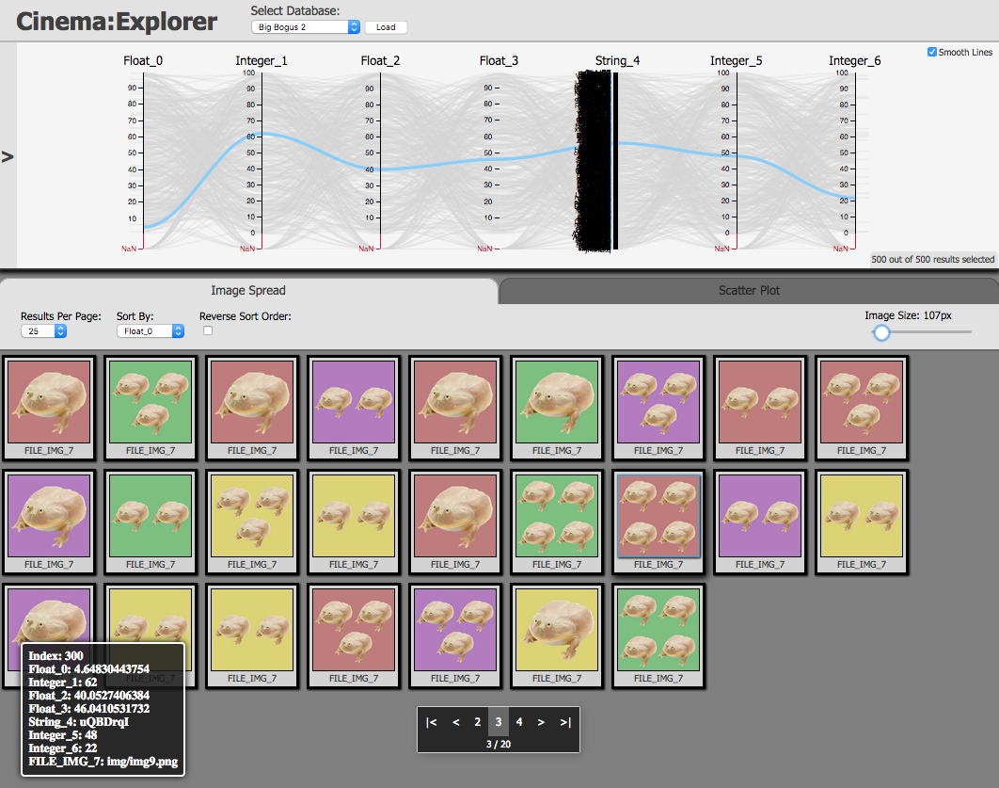

.. _ref_label_viewer_tutorial:

CinemaScience Tutorial: Viewers
===============================

This tutorial will help the user explore the CinemaScience ecosystem.  It will discuss how to view Cinema databases (CDBs) with the standard Cinema Viewers.

The `CinemaScience GitHub`_ page and the `CinemaScience website`_ are useful sources for more information and ideas.

Viewing Cinema Databases
------------------------
*Note: Cinema databases should be viewed in Firefox to avoid security errors.*

The two basic Cinema viewers operate on the Cinema Spec D specification.  In each case, CDBs are assumed to reside in a data/ directory.  Each CDB consists of a default data.csv file with columns of data abstracts following Spec D requirements and any subdirectories needed for the data abstracts such as images or vti files or additional csv files.  The control of the database viewers is described below.

Cinema:Compare
^^^^^^^^^^^^^^

Cinema:Compare is designed to access the images within a CDB, providing sliders spanning the values in the databases in order to select a specific image or set of comparison images.   Cinema:Compare can be downloaded from the `cinema_compare`_ GitHub page.  This download will result in several directories and an **index.html**:

.. code:: bash

  $ ls -l
      cinema
      data
      doc
      index.html

The data/ directory includes a test CDB, the database file, data.csv, and the image/ subdirectory with the images arranged into subfolders by phi.

.. code:: bash

  cinema_compare/data/sphere.cdb/data.csv
  cinema_compare/data/sphere.cdb/image/-18/0.png

In the default sphere example, there are 20 phi values and 1 theta value saved in the data.csv:

.. code::

  theta,phi,FILE
  0,-180,image/-180/0.png
  0,-162,image/-162/0.png
  0,-144,image/-144/0.png
  0,-126,image/-126/0.png
  0,-108,image/-108/0.png
  0,-90,image/-90/0.png
  0,-72,image/-72/0.png
  0,-54,image/-54/0.png
  0,-36,image/-36/0.png
  0,-18,image/-18/0.png
  0,0,image/0/0.png
  0,18,image/18/0.png
  0,36,image/36/0.png
  0,54,image/54/0.png
  0,72,image/72/0.png
  0,90,image/90/0.png
  0,108,image/108/0.png
  0,126,image/126/0.png
  0,144,image/144/0.png
  0,162,image/162/0.png

The **index.html** file defines the set of databases to display in the **dataSets** variable.  Edit **index.html** and modify **dataSets** to point to one or more databases.

Viewing the single sphere requires a single database entry in **dataSets**:

.. code:: javascript

  // START: Array of databases to view
      var dataSets = [ "data/sphere.cdb" ];
   // END : Array of databases to view

Opening **index.html** in Firefox:

.. code:: bash

    $ open index.html -a Firefox

will bring up the Cinema\:Compare viewer.  The sliders allow you to change the image size and the orientation.

.. image:: images/CinemaCompareSphere.png
    :width: 98%
    :alt: MPAS image
    :align: left

Editing the **dataSets** variable in **index.html** file to compare multiple databases. The sliders control all three databases in common:

.. code:: javascript

     // START: Array of databases to view
         var dataSets = [ "data/wavelet1.cdb", "data/wavelet2.cdb", "data/wavelet3.cdb" ];
      // END : Array of databases to view

Note that mistyping a database name or forgetting the **data/** directory part will result in a **TypeError**.  Open the console window if nothing appears and check for the error.  If so, check the **dataSets** variable in the **index.html** file for errors.

.. code::

   TypeError: results is undefined

Note that videos showing Cinema:Compare for single and multiple databases can be seen on the `CinemaScience Examples`_ website.

Cinema:Explorer
^^^^^^^^^^^^^^^

Cinema\:Explorer is a parallel coordinates approach to selecting and viewing data in a Cinema database.  Cinema\:Explorer can be downloaded from the `cinema_explorer`_ GitHub page.  This download will result in several directories and an cinema_explorer.html:

.. code:: bash

  $ ls -l
      cinema
      data
      doc
      cinema_explorer.html

The default **data/** directory contains subdirectories with example CDBs to illustrate the range of functionality of Cinema:Explorer.  Again, each CDB consists of a **data.csv** file and an **image/** subdirectory or other subdirectories as needed for its data artifacts.  For example, file_types.cdb includes a **wavelet/** subdirectory with vti files that can be viewed with Cinema:Explorer.

.. code:: bash

  bogus/
    big_bogus_1.cdb/
    big_bogus_2.cdb/
    big_bogus_3.cdb/
    big_bogus_4.cdb/
    bogus_1.cdb/
    bogus_2.cdb/
    bogus_3.cdb/
    bogus_4.cdb/
  file_types.cdb/
    image/
    wavelet/*.vti
  sphere_multi-image.cdb/
  sphere... code-block::

The set of databases for Cinema\:Explorer is defined in the **databases.json** file found in:

.. code:: bash

    cinema_explorer/cinema/explorer/1.9/databases.json

**databases.json** follows JSON syntax rules.  Each database entry minimally requires a name and a directory.

.. code:: json

  [
	   {
		   "name" : "sphere",
		    "directory" : "data/sphere.cdb"
	   },
     {
       "name" : "Many File Types",
       "directory" : "data/file_types.cdb"
     }
  ]

Opening the **cinema_explorer/cinema_explorer.html** file in Firefox

.. code:: bash

    $ open cinema_explorer.html -a Firefox

will bring up Cinema:Explorer in a browser window.  The default view has a parallel coordinates display of the **data.csv** columns.  Each column corresponds to an axis.

.. image:: images/CinemaExplorerSphere.png
    :width: 98%
    :align: left

The database names, as given in the **databases.json** control file, will appear in a dropdown menu under **Select Database:** in the Cinema:Explorer browser window.  After selecting a CDB, click on the **Load** button to switch to that CDB.

.. image:: images/SelectDatabaseDropdown.png
    :width: 45%
    :scale: 115%
    :align: left

.. image:: images/SelectDatabaseLoadButton.png
    :width: 45%
    :scale: 90%
    :align: left

Under the parallel coordinates, the default tab is the **Image Spread** component.  The image spread includes controls to change the image size, the results per page, and the sort variable and order.  Let's switch to the **Big Bogus 2** database.  It has several additional axes of (bogus) variables and more images than can fit in a single page.  Note that Cinema:Explorer switches between Canvas and SVG versions to accommodate the size of the database.

The page navigation widget at the bottom of the **Image Spread** allows the user to cycle through all the images.

The second tab, on the right, is a **ScatterPlot** component.  Each axis variable can be chosen from a dropdown menu of all axes so each variable can be plotted against any other variable.

.. image:: images/ScatterPlotExample.png
    :width: 98%
    :align: left

The parallel component view provides a standard set of flexible actions to select and highlight data.  Hovering over a specific data point or image in the CDB highlights its trace in the parallel coordinates plot and brings up a card with the detailed information from that database row:

Another useful feature is a modal view.  Clicking on a single image will bring up that image for closer inspection. Clicking anywhere in the main screen will dismiss the modal image.  Here we select the image highlighted above.

.. image:: images/ModalExample.png
    :width: 100%
    :align: left

A subset of the data can be selected via the parallel component axes.  Left-mouse-click-hold-and-drag to select a range on an axis.  A subset of six of the original 20 images is now visible:

.. image:: images/AxisSelection1.png
    :width: 95%
    :align: left

That range can be shifted by hovering over the selected range then left-mouse-click-hold-and-drag.  Or it can be modified by selecting one edge and dragging just one edge to increase or decrease the selection range.  Here, the range has been decreased to only select four of the database rows/images:

.. image:: images/AxisSelection2.png
    :width: 95%
    :align: left

The selection can be cancelled by clicking on the previously selected axis.  This is a particularly useful feature to, e.g., identify and explore outliers in the data.

Other Cinema Viewers and Components
^^^^^^^^^^^^^^^^^^^^^^^^^^^^^^^^^^^

CinemaScience includes additional components that can be added by the user to create analysis and data specific viewers. These components include:

- PcoordSVG
- PcoordCanvas
- Glyph
- ImageSpread
- Query
- ScatterPlotSVG
- ScatterPlotCanvas

Details information on these components can be found on the `cinema_components GitHub`_ page.

Additionally, there are other application-specific Cinema viewers that are useful examples and inspiration for Cinema users and developers.  We invite you to explore the `CinemaScience GitHub`_ for an up-to-date listing of example viewers.

.. _CinemaScience GitHub : https://github.com/cinemascience
.. _CinemaScience website : https://cinemascience.github.io
.. _cinema_compare : https://github.com/cinemascience/cinema_compare
.. _cinema_explorer : https://github.com/cinemascience/cinema_explorer
.. _CinemaScience Examples : https://cinemascience.github.io/examples.html
.. _cinema_components GitHub : https://github.com/cinemascience/cinema_components

.. toctree::
   :maxdepth: 2
