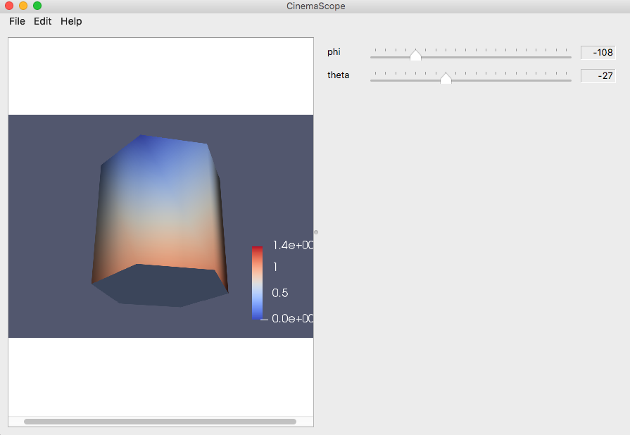

.. _label_tutorial_viewers:

Tutorial: Cinema Viewers
========================

This tutorial will help the user explore the CinemaScience ecosystem.  It will discuss how to view Cinema databases (CDBs) with the standard Cinema Viewers.

The `CinemaScience GitHub`_ page and the `CinemaScience website`_ are useful sources for more information and ideas.

.. note::

  To use browser based viewers, you need to allow local file access.  See :ref:`label_browser_security` for more information.

Viewing Cinema Databases
------------------------
**Note: Cinema databases should be viewed in Firefox to avoid cross origin security errors.**

The basic Cinema viewers operate on the Cinema Spec D specification.  In each case, CDBs are assumed to reside in a **data/** directory.  Each CDB consists of a default **data.csv** file with columns of data abstracts following Spec D requirements (see :ref:`label_specifications`), and any subdirectories needed for the data abstracts such as images, vti files, or additional csv files.  The database viewers are described below.

.. _label_tutorial_view:

Cinema:View
--------------

Cinema:View is designed to access the images within one or more CDBs, providing sliders spanning the values in the databases in order to select a specific image or set of comparison images.   Cinema:View can be downloaded from the `cinema_view`_ GitHub page.  This download will result in several directories and a **cinema_view.html**:

.. code:: bash

  $ ls -l
      cinema
      data
      doc
      cinema_view.html

The **data/** directory includes a **databases.json** file and a test CDB, **sphere.cdb** with its required **data.csv**, and an **image/** subdirectory with the images arranged into subfolders by the phi variable.

.. code:: bash

  cinema_view/data/sphere.cdb/data.csv
  cinema_view/data/sphere.cdb/image/-18/0.png

In the default sphere example, there are 20 phi values and 1 theta value saved in the **data.csv**:

.. code::

  theta,phi,FILE
  0,-180,image/-180/0.png
  0,-162,image/-162/0.png
  0,-144,image/-144/0.png
  0,-126,image/-126/0.png
  0,-108,image/-108/0.png
  0,-90,image/-90/0.png
  0,-72,image/-72/0.png
  0,-54,image/-54/0.png
  0,-36,image/-36/0.png
  0,-18,image/-18/0.png
  0,0,image/0/0.png
  0,18,image/18/0.png
  0,36,image/36/0.png
  0,54,image/54/0.png
  0,72,image/72/0.png
  0,90,image/90/0.png
  0,108,image/108/0.png
  0,126,image/126/0.png
  0,144,image/144/0.png
  0,162,image/162/0.png

The **cinema_view.html** file defines the set of databases to display in the **dataSets** variable.

Opening **cinema_view.html** in Firefox:

.. code:: bash

    $ open cinema_view.html -a Firefox

will bring up the Cinema:View viewer, shown in :numref:`fig_viewSphere`.  The sliders allow you to change the image size and the orientation.

    Using Cinema:View to explore a single Cinema database, a sphere.

This basic viewer allows the user to view a single database or a set of databases, e.g., :numref:`fig_viewSedov`, created with the same parameter set.

.. figure:: images/CinemaViewSedov.png
    :name: fig_viewSedov
    :width: 98%
    :alt: Three different versions of the Sedov blast wave viewed in Cinema:View.
    :align: left

    Using Cinema:View to explore a multiple Cinema databases, three visualizations of a Sedov blast wave.

The set of databases can be changed by editing the **data/databases.json** file (example below).  The dropdown menu allows the user to select the database or set of databases to view.  If viewing a set of databases, the sliders control all three databases in common.

.. literalinclude:: example_view_databases.json
   :language: json
   :lines: 1-

.. note::

    Mistyping a database name or forgetting the **data/** directory part will result in a **TypeError**.  Open the console window if nothing appears and check for the error.  If so, check the **data/databases.json** file for errors.

.. code::

   TypeError: results is undefined

.. _label_tutorial_explorer:

Cinema:Explorer
---------------

CinemaExplorer is a parallel coordinates approach to selecting and viewing data in a Cinema database.  CinemaExplorer can be downloaded from the `cinema_explorer`_ GitHub page.  This download will result in several directories and an **cinema_explorer.html**:

.. code:: bash

  $ ls -l
      cinema
      data
      doc
      cinema_explorer.html

The default **data/** directory contains subdirectories with example CDBs to illustrate the range of functionality of CinemaExplorer.  Again, each CDB consists of a **data.csv** file and any needed subdirectories for its data artifacts.  An **image/** directory is common and the **file_types.cdb** includes a **wavelet/** subdirectory with vti files that can be viewed with CinemaExplorer.

.. code:: bash

  bogus/
    big_bogus_1.cdb/
    big_bogus_2.cdb/
    big_bogus_3.cdb/
    big_bogus_4.cdb/
    bogus_1.cdb/
    bogus_2.cdb/
    bogus_3.cdb/
    bogus_4.cdb/
  file_types.cdb/
    image/
    wavelet/*.vti
  sphere_multi-image.cdb/
  sphere.cdb/

The set of databases for CinemaExplorer is defined in a **databases.json** file found in:

.. code:: bash

    cinema_explorer/cinema/explorer/1.9/databases.json

**databases.json** follows JSON syntax rules.  Each database entry minimally requires a name and a directory.

.. code:: json

  [
	   {
		   "name" : "sphere",
		    "directory" : "data/sphere.cdb"
	   },
     {
       "name" : "Many File Types",
       "directory" : "data/file_types.cdb"
     }
  ]

Opening the **cinema_explorer/cinema_explorer.html** file in Firefox

.. code:: bash

    $ open cinema_explorer.html -a Firefox

will bring up Cinema:Explorer in a browser window.  The default view has a parallel coordinates display of the **data.csv** columns.  Each column corresponds to an axis.  :numref:`fig_explorerSphere` shows a simple sphere in Cinema:Explorer.

    A simple sphere database in a Cinema:Explorer window

By default, the first database listed in **databases.json** will initially load.  All databases in **databases.json** will appear in a dropdown, :numref:`fig_dropdown` (left), menu under **Select Database:** in the CinemaExplorer browser window.  After selecting a CDB, click on the **Load**, :numref:`fig_dropdown` (right), button to switch to that CDB.

    A dropdown menu displays databases listed in the **databases.json** control file. Don't forget to press the **Load** button to load a new database.

Under the parallel coordinates, the default tab is the **Image Spread** component.  The image spread includes controls to change the image size, the results per page, and the sort variable and order.  Let's switch to the **Big Bogus 2** database, :numref:`fig_bigBogus`.  It has several additional axes of (bogus) variables and more images than can fit in a single page.  Note that CinemaExplorer switches between Canvas and SVG versions to accommodate the size of the database.

.. figure:: images/BigBogus2Overview.png
    :name: fig_bigBogus
    :alt: Big bogus database with lots of parameters and pictures of frogs.
    :width: 98%
    :align: left

    This database illustrates the ability to have many parameters or variables in a large database linking to specific images.  The page navigation widget at the bottom of the **Image Spread** allows the user to cycle through all the images.

The second tab, on the right, is a **ScatterPlot** component.  Each axis variable can be chosen from a dropdown menu of all axes so each variable can be plotted against any other variable.

    The scatter plot tab is part of the default Cinema:Explorer capability.  Dropdown menus for each axis allows the user to select a specific variable for that axis.

The parallel component view provides a standard set of flexible actions to select and highlight data.  Hovering over a specific data point or image in the CDB highlights its trace in the parallel coordinates plot and brings up a card with the detailed information from that database row, :numref:`fig_pcpHighlight`.

.. figure:: images/PCoordHighlight.png
    :name: fig_pcpHighlight
    :alt: Linked highlighting typical of parallel coordinates.
    :width: 100%
    :align: left

    Parallel coordinates support linked views -- highlighting an entry in one linked plot will highlight the same entry in the scatterplot or in the image spread.

Another useful feature is a modal view.  Clicking on a single image will bring up that image for closer inspection. Clicking anywhere in the main screen will dismiss the modal image.  In :numref:`fig_modal`, we select the image highlighted above.

    Modal view is used to show a closeup of a single image.

A subset of the data can be selected via the parallel component axes.  Left-mouse-click-hold-and-drag to select a range on an axis.  A subset of six of the original 20 images is now visible in :numref:`fig_axisSelection1`.  That range can be shifted by hovering over the selected range then left-mouse-click and hold-and-drag.  Or it can be modified by selecting one edge and dragging just that edge to increase or decrease the selection range.  In :numref:`fig_axisSelection2`, the range has been decreased to only select four of the database rows/images:

    Selecting a range on the phi axis shows only those images linked to the phi values in that range.

    The range has been decreased to only include four images.

The selection can be cancelled by clicking on the previously selected axis (in an unselected area).  Defining and selecting ranges on the axes is a particularly useful feature to, e.g., identify and explore outliers in the data.

Optional Control Fields for databases.json
^^^^^^^^^^^^^^^^^^^^^^^^^^^^^^^^^^^^^^^^^^

There are three optional control fields that can be implemented within the **database.json** file to control the data viewed on the parallel coordinates axes.

- **filter** is a JSON regular expression which removes the specified axes (columns) whose header matches the regex.  Note that adding **filter** will override the default filtering for any FILE* columns so those will need to be explicitly removed.  This example with the Bogus 1 data removes the Float_6 axis and all axes that begin with FILE:

.. code:: json

  {
    "name" : "Bogus 1",
    "directory" : "data/bogus/bogus_1.cdb",
    "filter" : "(^Float_6)|(^FILE)"
  }

- **query** queries the database and only displays those rows that match the criterion for the columns queried.  This example with the Bogus 1 data displays only those rows where Float_6 is within the range [20-70] and Interger_2 is within the range [40, 60]:

.. code:: json

  {
    "name" : "Bogus 1",
    "directory" : "data/bogus/bogus_1.cdb",
    "query": {
      "Float_6" : [20, 70],
      "Integer_2": [40, 60]
    }
  }

- **selection** applies an axis selection when the database is loaded but loads all database rows.  This example with the Bogus 1 data brings up the database with the selection on Integer_3 already in place, :numref:`fig_selectExample`.

.. code:: json

  {
    "name" : "Bogus 1",
    "directory" : "data/bogus/bogus_1.cdb",
    "selection": {
			"Integer_3": [20, 50]
		}
  }

    The Integer_3 axis has a pre-selected range applied.

.. _label_tutorial_scope:

Cinema:Scope
------------

Cinema:Scope is a prototype cross platform application viewer to interactively explore images in a Cinema database.  Cinema:Scope can be found on the `cinema_scope GitHub`_ page.  Under the readme, click on **buildpassing** to bring up the list of builds.  Currently, builds are available for Linux, Windows, MacOS, and MacOS/Xcode.

    Cinema:Scope uses GitHub's Travis CI.  The dashboard shows current builds.

Download the relevant build and install.  Test databases are available in https://github.com/cinemascience/cinema_scope/tree/master/docs/data/test_cylinder.cdb.zip.

Open CinemaScope after it has installed.  Click on **File** -> **Open** to open the directory and select the data set by highlighting **test_cylinder.cdb** (do not click into the directory) and clicking **Open**, :numref:`fig_openCS`.  A test cylinder is viewed in :numref:`fig_cylinderCS`.

    Left: click on **File** -> **Open** and navigate to the location of the <filename>.cdb database that you want to open.  Select but do not click into the cdb directory.

    A test cylinder is view in Cinema:Scope.

The mouse wheel can be used to increase/decrease image size.  Each parameter in the CDB data.csv will correspond to a slider.  The sliders can be used to control the parameter values.  In this case, changing phi and theta rotate the cylinder, :numref:`fig_cylinderRotated`.

Mouse drag can also be used to scroll through the images.  Up/down is linked by default to theta while left/right is linked to phi.  The linked parameters can be modified using the **Map Parameters Dialog** shown in :numref:`fig_mapParamsCS`.  Click **Edit** --> **Edit Parameters** to open the dialog and select the parameters from each dropdown menu. For CDBs with multiple artifacts, the **Artifact** dropdown menu will allow you to access each set of images.

    The Map Paramters Dialog box can be used to map the intuitive mouse controls to specific parameters in the Cinema database that is being viewed in Cinema:Scope.

An optional **csettings.json** file, which must be located in the \*.cdb directory, can be used to limit the number of parameters actually linked to a slider or reorder a list of parameter columns.  The colorder ("column order") variable contains the list of actively linked parameters.

.. code-block:: JSON

    {
        "colorder" : ["phi", "theta", "xValue", "yValue", "zValue", "FILE", "FILE_2"]
    }

Other Cinema viewers
^^^^^^^^^^^^^^^^^^^^

Additionally, there are other application-specific Cinema viewers that provide useful examples and inspiration for Cinema users and developers.  We invite you to explore the `CinemaScience GitHub`_ for an up-to-date listing of example viewers.  Cinema Viewers, in particular CinemaScope, are in active development.  We invite users to join the Cinema community and contribute to the Cinema project.

.. _CinemaScience GitHub : https://github.com/cinemascience
.. _CinemaScience website : https://cinemascience.github.io
.. _cinema_view : https://github.com/cinemascience/cinema_view
.. _cinema_explorer : https://github.com/cinemascience/cinema_explorer
.. _CinemaScience Examples : https://cinemascience.github.io/examples.html
.. _cinema_components GitHub : https://github.com/cinemascience/cinema_components
.. _cinema_scope GitHub : https://github.com/cinemascience/cinema_scope

.. toctree::
   :maxdepth: 2
