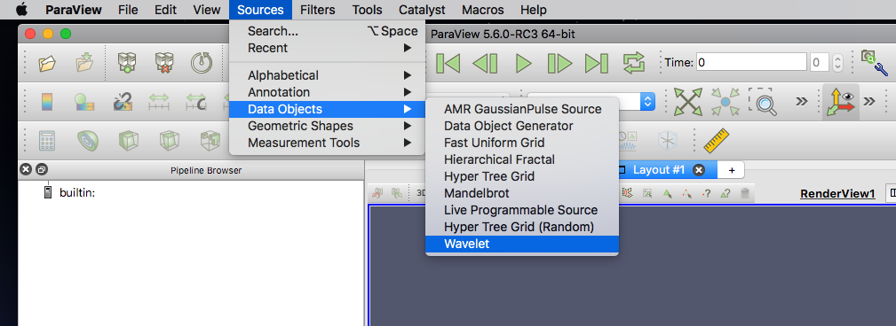
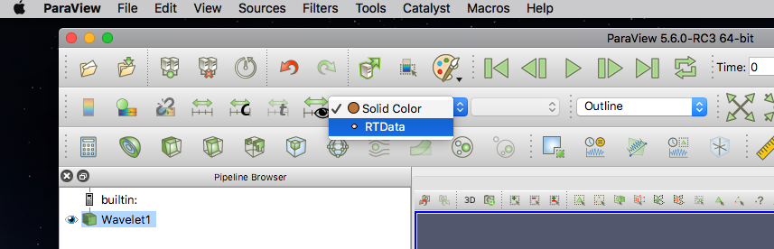
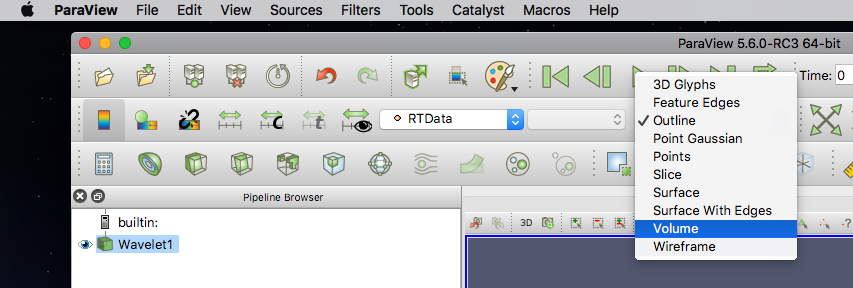
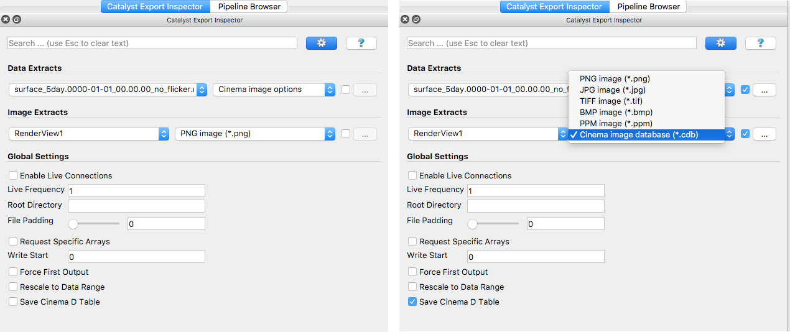
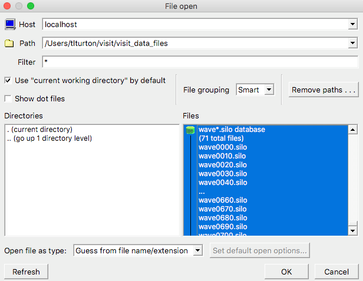
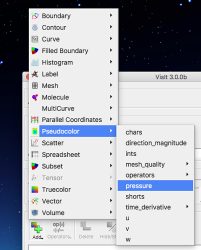
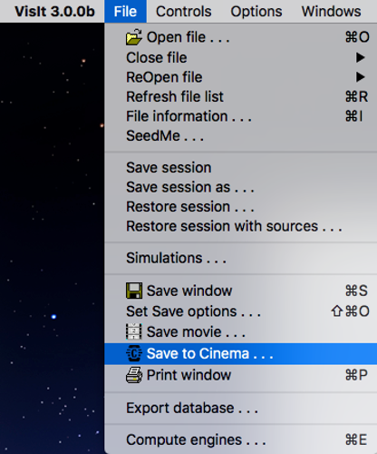
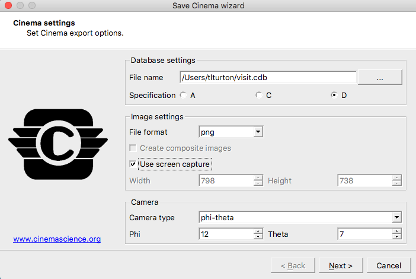
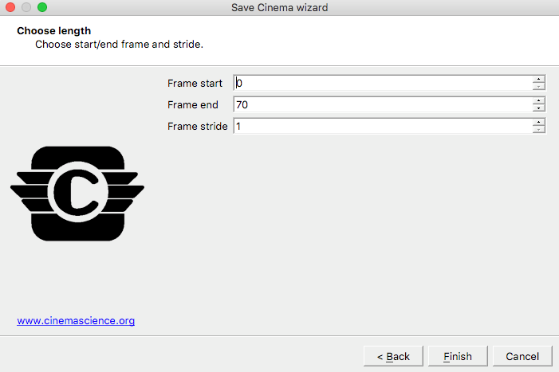

.. _label_workflow:

Tutorial: Cinema Workflows
==========================

This tutorial will help the user explore the CinemaScience ecosystem and give examples for possible workflows, including how to generate or export Cinema databases (CDBs).

The `CinemaScience GitHub`_ page and the `CinemaScience website`_ are useful sources for more information and ideas.

Custom Script
^^^^^^^^^^^^^
The most basic approach is a custom script that generates a database according to the Cinema Specifications, :ref:`label_specifications`.  This approach may be appropriate for both simulation and experimental data, run statistics, or other already extant datasets.  Taking in one CDB, perfoming analysis and outputting an updated CDB is a common workflow.

Any programming language can be used but here we demonstrate a pandas dataframe approach.  In this psuedo script, an input csv file is read in, manipulated, has a final image FILE column added and then is written out to a CDB.  Along the way, the necessary directories are created and the images are moved over from an input directory to the data/image directory.

.. literalinclude:: customCinemaWriter.py
   :language: python
   :lines: 1-

PostProcessing via ParaView Cinema Export Wizard
^^^^^^^^^^^^^^^^^^^^^^^^^^^^^^^^^^^^^^^^^^^^^^^^

The current ParaView release v5.6 (in Release Candidate status as of this writing) has a Cinema Export Wizard that outputs Cinema Spec A databases.  These can be converted to Cinema Spec D databases through the cinema_lib command line interface.  The Cinema Spec D export wizard will be included in an upcoming ParaView release.  This tutorial will be updated when that change takes place.  The basic functionality will be similar to the following.

A Cinema database can be exported directly from ParaView.  This can be demonstrated with a wavelet source.  Open ParaView, select **Sources** -> **Data Objects** --> **Wavelet**.  Click on **Apply** to load a basic wavelet.

Select **RTData** as the variable of interest and choose a **Volume** representation (answer Yes when it asks if you want to change the representation type):

File, open Export Scene.  This will bring up the export dialog to input the CDB name and location.  The Cinema Export Wizard will pop up.  On the left is the default export dialog.  A typical set of answers to generate a CDB placing cameras around the globe is given on the right.  The Cinema export will automatically cycle through all time steps present in the data.

This Spec A data can be converted to a Spec D CDB using the cinema_lib tools. Please see :ref:`label_convert_a2d` for details.  Once converted, the Spec D database is available for viewing in one of the Cinema Viewers as explained in the Viewer tutorial, :ref:`label_tutorial_viewers`.

In Situ via ParaView Catalyst
^^^^^^^^^^^^^^^^^^^^^^^^^^^^^

ParaView's in situ Catalyst library can be used to output Cinema Spec D databases.  Within ParaView, again, load the data and create the visualization you wish to generate in situ.  From the **Catalyst** menu, select **Define Exports** to open the **Catalyst Export Inspector**.  On the left is the default script, on the right, a set of choices to export a Cinema database.  The Cinema Image Database option has been selected along with *Save Cinema D Table*.

Then choose **Export Catalyst Script** from the ParaView Catalyst menu and enter a location and name for the exported python script.  The exported script can be edited to fine-tune as needed.  This script can then be integrated into an in situ pipeline.

The `ParaView Python Documentation`_ is an excellent source of information on how to create a Catalyst pipeline.

PostProcessing via VisIt Cinema Export Wizard
^^^^^^^^^^^^^^^^^^^^^^^^^^^^^^^^^^^^^^^^^^^^^

A Cinema Export Wizard is an addition to the VisIt v3.0 release, currently in beta release.  This tutorial is based on the beta release and will be updated when VisIt v3.0 is officially released.

A Cinema database can be exported directly from VisIt. This can be demonstrated with sample data that can be downloaded from the `VisIt tutorial`_ page.  Start by clicking on **Open** to bring up the VisIt **File open** dialog box.  Navigate to the correct directory, select the data you wish to visualize and click **OK**:

Click **Add**, select **Pseudocolor** and choose an appropriate variable such as **pressure**.
On the control bar, click **File** --> **Save To Cinema** to bring up the VisIt Cinema database dialog:

In the Cinema wizard, change the database name and path as needed, select Spec D for the current Cinema specification and choose **Use screen capture** to select the entire VisIt viewing window.  The **Camera type** can be either **static** (no rotation, only time evolution of the currently rendered view) or **phi-theta** for the default rotations.  Modify the number of phi and theta camera locations as desired.  Click  **Next**.  On the next window, choose the number of frames (time steps) to include and click **Finish**.

Note:  The beta version currently adds an unnecessary column (max and min of the rendered variable) to the data.csv file.  The user will need to edit data.csv to delete this column.  (Issue is opened and fix is underway.)

In Situ via VisIt LimSim
^^^^^^^^^^^^^^^^^^^^^^^^

In Situ via ALPINE Ascent
^^^^^^^^^^^^^^^^^^^^^^^^^

.. _CinemaScience GitHub : https://github.com/cinemascience
.. _CinemaScience website : https://cinemascience.github.io
.. _cinema_compare : https://github.com/cinemascience/cinema_compare
.. _cinema_explorer : https://github.com/cinemascience/cinema_explorer
.. _CinemaScience Examples : https://cinemascience.github.io/examples.html
.. _ParaView Python Documentation : https://kitware.github.io/paraview-docs/latest/python/quick-start.html
.. _VisIt tutorial: https://wci.llnl.gov/simulation/computer-codes/visit/manuals

.. toctree::
   :maxdepth: 2
