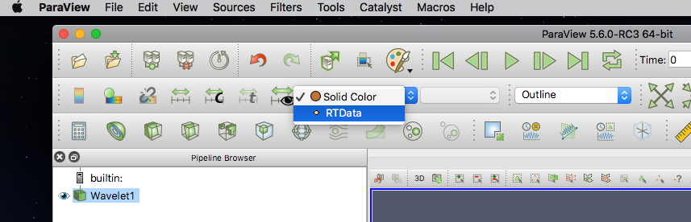
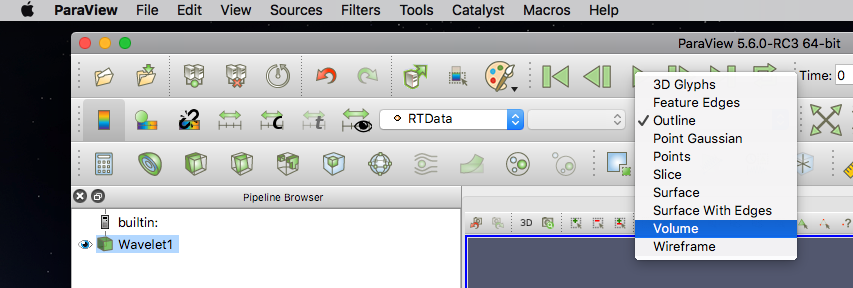

.. _label_workflow_pv56:

Post-Processing via ParaView 5.6 Cinema Export Scene
^^^^^^^^^^^^^^^^^^^^^^^^^^^^^^^^^^^^^^^^^^^^^^^^^^^^

The current ParaView release v5.6 (in Release Candidate status as of this writing) has a Cinema Export Wizard that outputs Cinema Spec A databases.  These can be converted to Cinema Spec D databases through the cinema_lib command line interface.  The Cinema Spec D export wizard will be included in an upcoming ParaView release.  This tutorial will be updated when that change takes place.  The basic functionality will be similar to the following.

A Cinema database can be exported directly from ParaView.  This can be demonstrated with a wavelet source.  Open ParaView, select **Sources** -> **Data Objects** --> **Wavelet**.  Click on **Apply** to load a basic wavelet.

.. image:: images/PV56waveletSource.png
    :width: 97%
    :align: left

Select **RTData** as the variable of interest and choose a **Volume** representation (answer Yes when it asks if you want to change the representation type):

File, open Export Scene.  This will bring up the export dialog to input the CDB name and location.  The Cinema Export Wizard will pop up.  On the left is the default export dialog.  A typical set of answers to generate a CDB placing cameras around the globe is given on the right.  The Cinema export will automatically cycle through all time steps present in the data.

This Spec A data can be converted to a Spec D CDB using the cinema_lib tools. Please see :ref:`label_convert_a2d` for details.  Once converted, the Spec D database is available for viewing in one of the Cinema Viewers as explained in the Viewer tutorial, :ref:`label_tutorial_viewers`.

.. _CinemaScience GitHub : https://github.com/cinemascience
.. _CinemaScience website : https://cinemascience.github.io
.. _cinema_compare : https://github.com/cinemascience/cinema_compare
.. _cinema_explorer : https://github.com/cinemascience/cinema_explorer
.. _CinemaScience Examples : https://cinemascience.github.io/examples.html
.. _ParaView Python Documentation : https://kitware.github.io/paraview-docs/latest/python/quick-start.html
.. _VisIt tutorial: https://wci.llnl.gov/simulation/computer-codes/visit/manuals
.. _ALPINE Ascent: https://alpine-dav.github.io/ascent/

.. toctree::
   :maxdepth: 2
