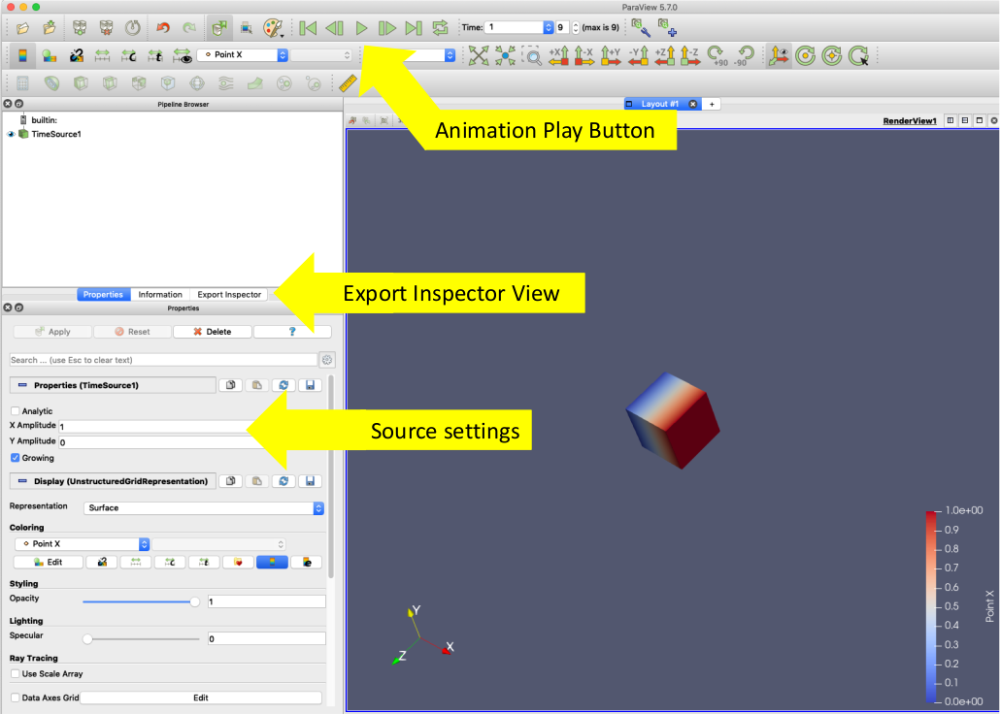
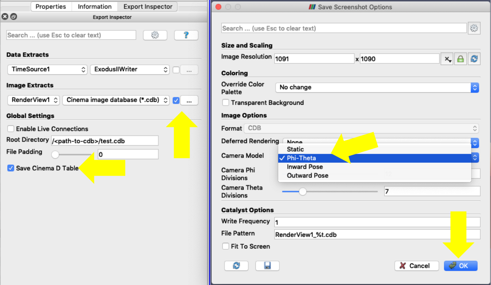

.. _label_workflow_pv57:

Post-Processing via ParaView 5.7 Export Inspector
^^^^^^^^^^^^^^^^^^^^^^^^^^^^^^^^^^^^^^^^^^^^^^^^^

ParaView provides Cinema database export functionality which can be used in a post-processing workflow to create Cinema databases from any dataset that can be loaded into ParaView.  This can be demonstrated with one of the sources available within ParaView. Open ParaView 5.7.0.  From the ParaView menu, select **Sources** -> **Time Source**.  We want to see time-varying behavior so under the Properties tab, change the X Amplitude to 1 and click on the Growing checkbox.  Under Coloring, choose Point X and a Surface Representation.  Make sure the visualization object is sufficiently small so that when you run the time animation (play button on the animation menu), you can see the time source expand and contract.  The image below illustrates this setup.

The Cinema export functionality can be found on the **Export Inspector** view which is available as one of the default tabs when ParaView is opened (see above image) or the Export Inspector can be opened from the ParaView **View** menu.  Click on the Export Inspector tab where you will see a set of default options.  To export a Cinema Database:

- Under **Image Extracts**, make sure the correct view is selected.  The default RenderView1 will usually be the right one.
- In the dropdown menu on the right, select **Cinema image database (*.cdb)** and click the checkbox to the right to establish that option.
- Open the ellipses menu to the right of the checkbox to get the Save Screenshot option menu.  When Cinema image database is chosen, it shows the Cinema options.  To get multiple camera angles, choose **Phi-Theta** from the **Camera Model** dropdown menu.
- Under **Root Directory**, add the complete path and output database name: /<path-to-cdb>/test.cdb.
- Under **File**, select **Export Now** to start the Cinema database export.

After generating the Cinema database, you can view it in one of the Cinema viewers :ref:`label_viewers`

Note: for users not familiar with ParaView, we refer you to the `ParaView Tutorial`_ to get started.

.. _CinemaScience GitHub : https://github.com/cinemascience
.. _CinemaScience website : https://cinemascience.github.io
.. _cinema_compare : https://github.com/cinemascience/cinema_compare
.. _cinema_explorer : https://github.com/cinemascience/cinema_explorer
.. _CinemaScience Examples : https://cinemascience.github.io/examples.html
.. _ParaView Python Documentation : https://kitware.github.io/paraview-docs/latest/python/quick-start.html
.. _VisIt tutorial : https://wci.llnl.gov/simulation/computer-codes/visit/manuals
.. _ALPINE Ascent : https://alpine-dav.github.io/ascent/
.. _ParaView Tutorial : https://www.paraview.org/Wiki/The_ParaView_Tutorial

.. toctree::
   :maxdepth: 1
