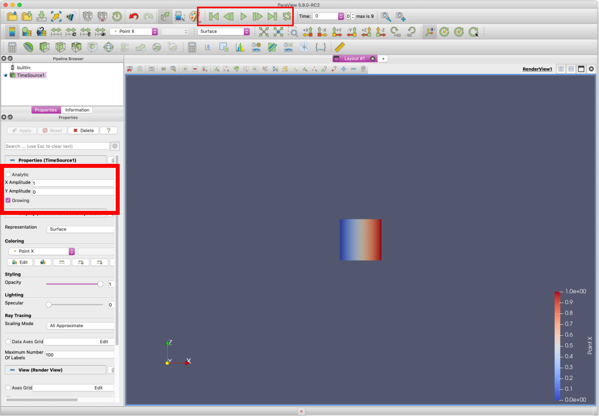
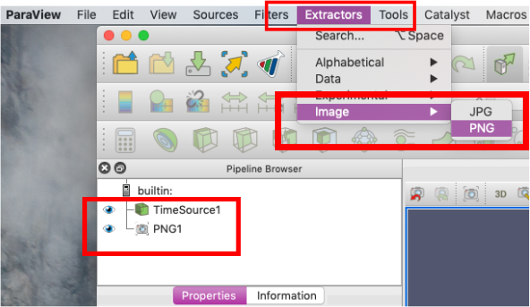
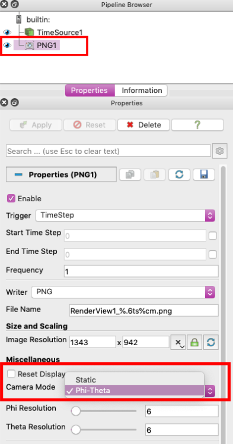
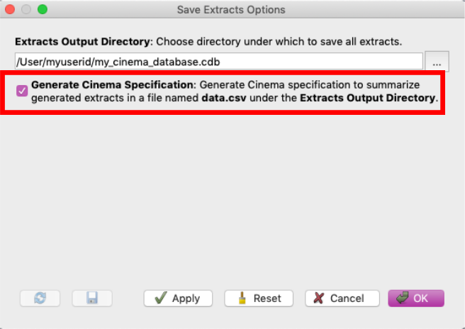

.. _label_workflow_pv59:

Post-Processing via ParaView 5.9 Export Inspector
^^^^^^^^^^^^^^^^^^^^^^^^^^^^^^^^^^^^^^^^^^^^^^^^^

ParaView provides extract functionality for Cinema databases.  This can be used in a post-processing workflow to create Cinema databases from any dataset that can be loaded into ParaView.  In ParaView 5.9 (currently in a release candidate version), the Cinema export has been moved into an updated Extractor scheme.

This can be demonstrated with one of the sources available within ParaView. Open ParaView 5.9 (currently RC2).  From the ParaView menu, select ``Sources`` -> ``Alphabetical`` -> ``Time Source``.  We want to see time-varying behavior so under the Properties tab, change the X Amplitude to 1 and click on the Growing checkbox (see red box on left).  Under ``Coloring``, choose ``Point X`` and a ``Surface`` Representation.  Make sure the visualization object is sufficiently small so that when you run the time animation (see red box on the top), you can see the time source expand and contract.  The image below illustrates this setup.

The Cinema database export functionality is accessed via the ``Extractor`` menu.  Click on ``Extractors`` -> ``Image`` -> ``PNG`` (or ``JPG``).  This will add a PNG (or JPG) element to the Pipeline Browser.  Within the Properties, select the Camera Mode, either Static or Phi-Theta.  Phi-Theta will produce images with the camera rotated at regularly spaced phi, theta intervals.

To export the Cinema database:

- Create an appropriate output directory, e.g.: /<path_to_dir>/my_cinema_database.cdb
- From the File menu, select ``Save Extracts``
- In the ``Save Extracts Options`` dialog box (shown below), enter the path to the extracts output directory created above or use the browse menu (three dots) to navigate to the directory.
- Click on the ``Generate Cinema Specification`` box to generate the data.csv file

After generating the Cinema database, you can view it in one of the Cinema viewers :ref:`label_viewers`

Note: for users not familiar with ParaView, we refer you to the `ParaView Tutorial`_ to get started.

.. _CinemaScience GitHub : https://github.com/cinemascience
.. _CinemaScience website : https://cinemascience.github.io
.. _cinema_view : https://github.com/cinemascience/cinema_view
.. _cinema_explorer : https://github.com/cinemascience/cinema_explorer
.. _CinemaScience Examples : https://cinemascience.github.io/examples.html
.. _ParaView Python Documentation : https://kitware.github.io/paraview-docs/latest/python/quick-start.html
.. _VisIt tutorial : https://wci.llnl.gov/simulation/computer-codes/visit/manuals
.. _ALPINE Ascent : https://alpine-dav.github.io/ascent/
.. _ParaView Tutorial : https://www.paraview.org/Wiki/The_ParaView_Tutorial

.. toctree::
   :maxdepth: 1
