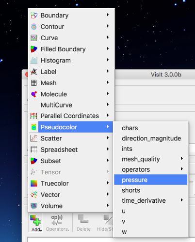
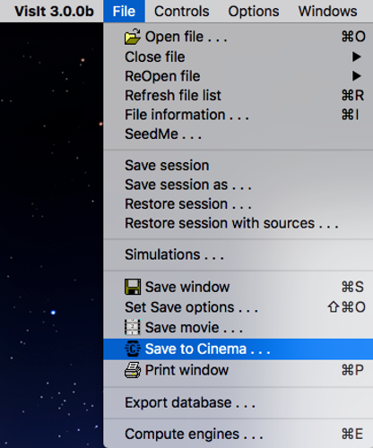
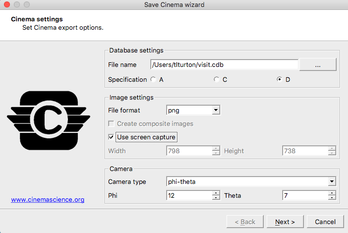

.. _label_workflow_visit:

Post-Processing via VisIt Cinema Export Wizard
^^^^^^^^^^^^^^^^^^^^^^^^^^^^^^^^^^^^^^^^^^^^^^

A Cinema Export Wizard is available in VisIt v3.0.2 to directly export a Cinema database from VisIt. This can be demonstrated with sample data that can be downloaded from the `VisIt tutorial`_ page.  Start by clicking on ``Open`` to bring up the VisIt ``File open`` dialog box.  Navigate to the correct directory, select the data you wish to visualize and click ``OK``:

.. image:: images/visit_openDataFiles.png
    :width: 98%
    :align: left

Click ``Add``, select ``Pseudocolor`` and choose an appropriate variable such as ``pressure``.
On the control bar, click ``File`` --> ``Save To Cinema`` to bring up the VisIt Cinema database dialog:

In the Cinema wizard, change the database name and path as needed, select Spec D for the current Cinema specification and choose ``Use screen capture`` to select the entire VisIt viewing window.  The ``Camera type`` can be either ``static`` (no rotation, only time evolution of the currently rendered view) or ``phi-theta`` for the default rotations.  Modify the number of phi and theta camera locations as desired.  Click  ``Next``.  On the next window, choose the number of frames (time steps) to include and click ``Finish``.

.. image:: images/visit_CinemaWizard2.png
    :width: 80%

VisIt may request permission to access a terminal window which provides verbose output on CDB export progress.

Note: for users not familiar with VisiT, we refer you to the `VisIt Documentation`_ to get started.

.. _CinemaScience GitHub : https://github.com/cinemascience
.. _CinemaScience website : https://cinemascience.github.io
.. _cinema_view : https://github.com/cinemascience/cinema_view
.. _cinema_explorer : https://github.com/cinemascience/cinema_explorer
.. _CinemaScience Examples : https://cinemascience.github.io/examples.html
.. _ParaView Python Documentation : https://kitware.github.io/paraview-docs/latest/python/quick-start.html
.. _VisIt tutorial: https://wci.llnl.gov/simulation/computer-codes/visit/manuals
.. _ALPINE Ascent: https://alpine-dav.github.io/ascent/
.. _VisIt Documentation : https://visit-sphinx-github-user-manual.readthedocs.io/en/develop/gui_manual/index.html

.. toctree::
   :maxdepth: 1
