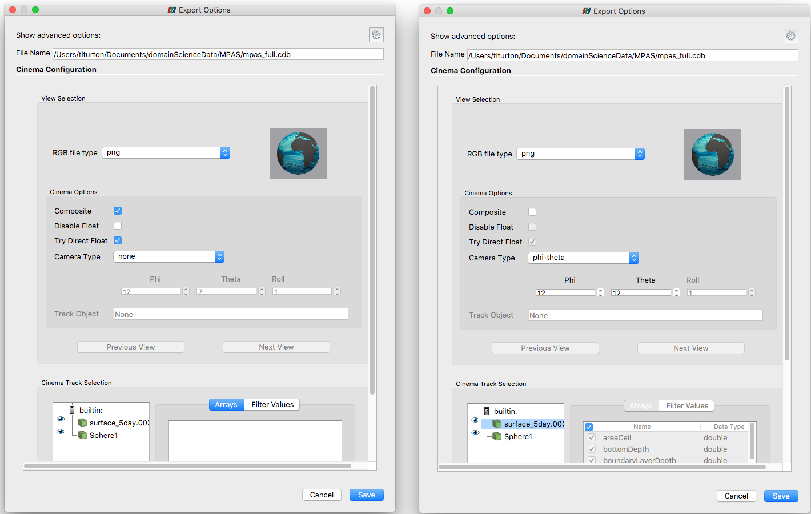

.. _ref_label_writer_tutorial:

CinemaScience Tutorial: Writers
===============================

This tutorial will help the user explore the CinemaScience ecosystem.  It will discuss how to generate or export Cinema databases (CDBs).

The `CinemaScience GitHub`_ page and the `CinemaScience website`_ are useful sources for more information and ideas.

Exporting & Generating Cinema Databases
---------------------------------------

PostProcessing via ParaView Cinema Export Wizard
^^^^^^^^^^^^^^^^^^^^^^^^^^^^^^^^^^^^^^^^^^^^^^^^

The current ParaView release v5.5.2 has a Cinema Export Wizard that outputs Cinema Spec A databases.  These can be converted to Cinema Spec D databases through the cinema_lib command line interface.  The Cinema Spec D export wizard will be included in an upcoming ParaView release.  This tutorial will be updated when that change takes place.  The basic functionality will be similar to the following.

A Cinema database can be exported directly from ParaView.  Open ParaView, load the data and create the visualization you with to export into a CDB.  Then under File, open Export Scene.  This will bring up the export dialog to input the CDB name and location.  The Cinema Export Wizard will pop up.  On the left is the default export dialog.  A typical set of answers to generate a CDB placing cameras around the globe is given on the right.  The Cinema export will automatically cycle through all time steps present in the data.

This Spec A data can be converted to a Spec D CDB. Once converted, the Spec D database is available for viewing in one of the Cinema Viewers as explained in the Viewer tutorial, :ref:`ref_label_viewer_tutorial`.

- TODO -- add Spec A to Spec D conversion process.

In Situ via ParaView Catalyst
^^^^^^^^^^^^^^^^^^^^^^^^^^^^^

ParaView's in situ Catalyst library can be used to output Cinema Spec D databases.  Within ParaView, again, load the data and create the visualization you wish to generate in situ.  From the **Catalyst** menu, select **Define Exports** to open the **Catalyst Export Inspector**.  On the left is the default script, on the right, a set of choices to export a Cinema database.  The Cinema Image Database option has been selected along with *Save Cinema D Table*.

.. image:: images/CatalystExportInspector.png
    :width: 97%
    :align: left

Then choose **Export Catalyst Script** from the ParaView Catalyst menu and enter a location and name for the exported python script.  The exported script can be edited fine-tune as needed.  This script can then be integrated into an in situ pipeline.

The `ParaView Python Documentation`_ is an excellent source of information on how to create a pipeline.

PostProcessing via VisIt Cinema Export Wizard
^^^^^^^^^^^^^^^^^^^^^^^^^^^^^^^^^^^^^^^^^^^^^

The current VisIt release v2.13.2 does not yet include the Cinema Export Wizard.  The Cinema Spec D export wizard will be included in the upcoming VisIt release v3.0 (scheduled for Fall 2018).  This tutorial will be updated when that change takes place.

In Situ via VisIt LimSim
^^^^^^^^^^^^^^^^^^^^^^^^

In Situ via ALPINE Ascent
^^^^^^^^^^^^^^^^^^^^^^^^^

Custom Script
^^^^^^^^^^^^^
A final approach is a custom script to generate a database.  This may be useful for experimental data, run statistics, or other already extant datasets.  Pandas dataframes provide an efficient approach.  In this psuedo script, an input csv file is read in, manipulated, has a final image FILE column added and then is written out to a CDB.  Along the way, the necessary directories are created and the images are moved over from an input directory to the data/image directory.

.. literalinclude:: customCinemaWriter.py
   :language: python
   :lines: 1-

.. _CinemaScience GitHub : https://github.com/cinemascience
.. _CinemaScience website : https://cinemascience.github.io
.. _cinema_compare : https://github.com/cinemascience/cinema_compare
.. _cinema_explorer : https://github.com/cinemascience/cinema_explorer
.. _CinemaScience Examples : https://cinemascience.github.io/examples.html
.. _ParaView Python Documentation : https://kitware.github.io/paraview-docs/latest/python/quick-start.html

.. toctree::
   :maxdepth: 2
