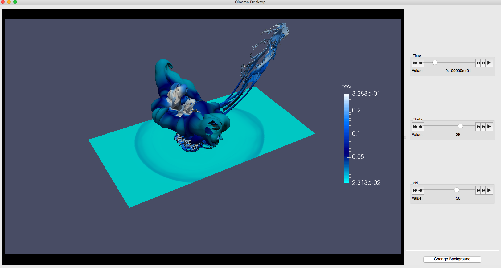
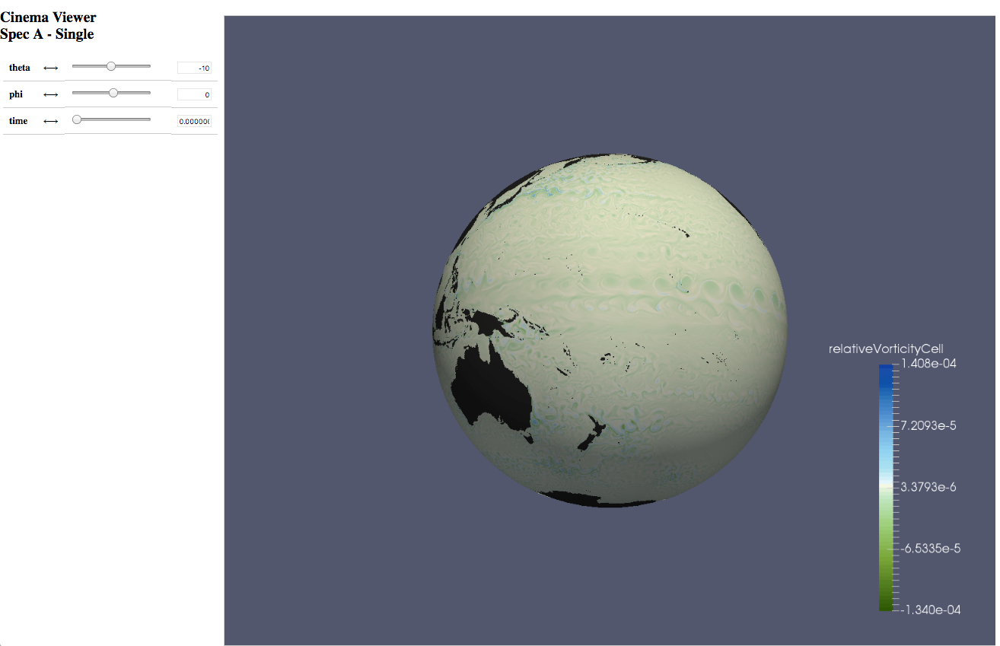
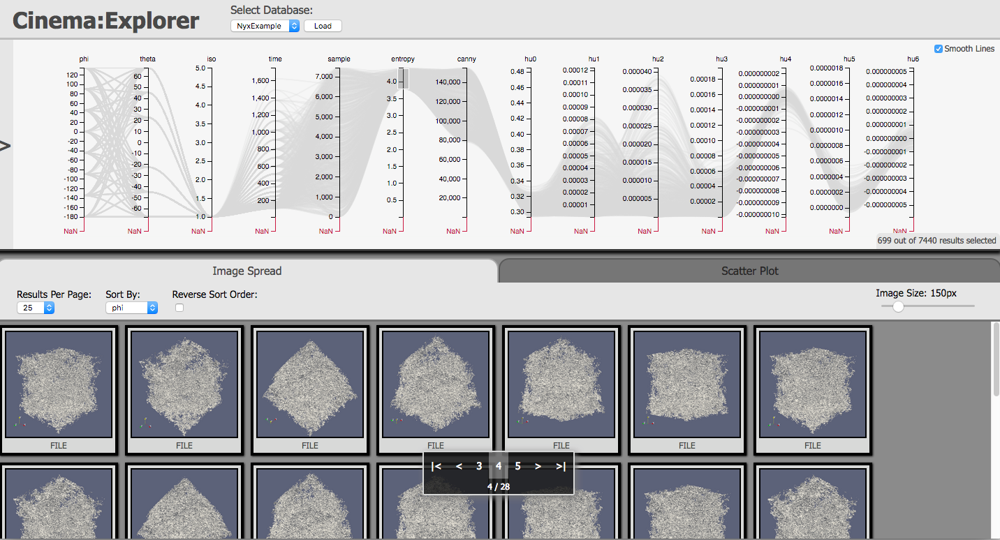

Cinema Science Viewers
======================

Todo: This section will detail the Cinema viewers.

.. toctree::
   :maxdepth: 2

Application Viewer
------------------

The basic application viewer for Spec A and C can be downloaded from the Cinema Science `download page <https://cinemascience.github.io/>`_.  This is a basic application that can be used to explore Cinema Spec A and C databases.  This example image shows the temperature variable from an asteroid impact database.  The database allows the user to explore the simulation in time, theta, and phi.  The user interface controls are defined by the arguments given in the info.json file.

Browser-based Viewer
---------------------

The browser based viewer for Spec A and C can be found on at   `Cinema Viewer <https://cinemaviewer.org/>`_, a demo javascript CinemaViewer and sample Cinema databases.  The data is loaded from an AWS elastic filesystem to the AWS instance hosting the website.

- Asteroid Impact Volume Rendered Cinema Database
- Ocean Vorticity Cinema Database (shown below)
- VPIC Data OSPRay Volume Rendered Cinema Database

Cinema:Explorer
---------------

Cinema:Explorer is a browser based viewer for Spec D databases.  It includes a parallel coordinates view and a scatterplot view. The columns are the data artifacts or derived quantities that are defined in the data.csv file for the Spec D database.  This example is shows the dark matter density from the Nyx cosmological simulation.  Note how one can choose a subset of the images to view by selecting a region along one of the variable axes.  

Other Viewers
-------------

The `Cinema Science github page <https://github.com/cinemascience>`_ contains other Cinema viewers and modules designed to help the user develop application-specific viewers.  The Cinema viewer projects include:

- `cinema_components <https://github.com/cinemascience/cinema_components>`_ A javascript library containing prebuilt components for viewing and querying Cinema SpecD databases.
- `cinema_explorer <https://github.com/cinemascience/cinema_explorer>`_ A parallel coordinates-based viewer for Spec-D Cinema Databases.
- `cinema_newsfeed <https://github.com/cinemascience/cinema_newsfeed>`_
- `cinema_quest <https://github.com/cinemascience/cinema_quest>`_ An interactive visual tool for querying Cinema Database ensembles.
