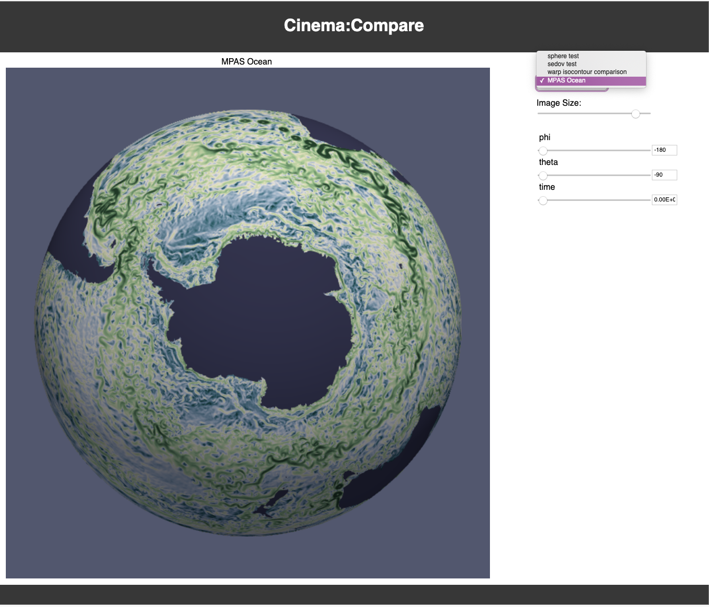
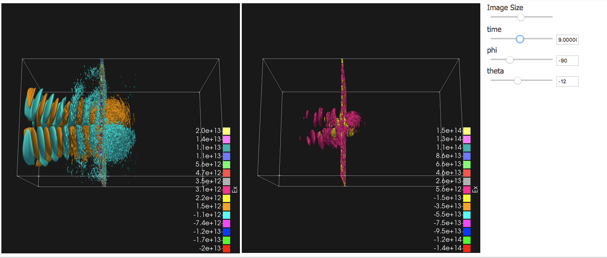
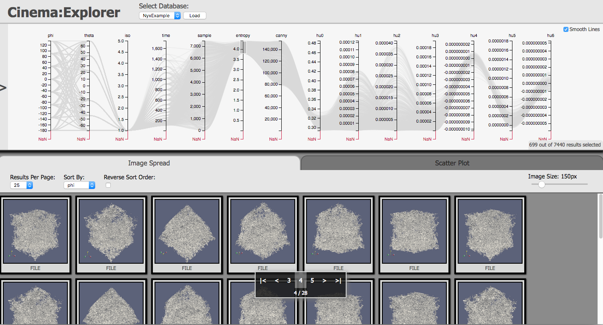
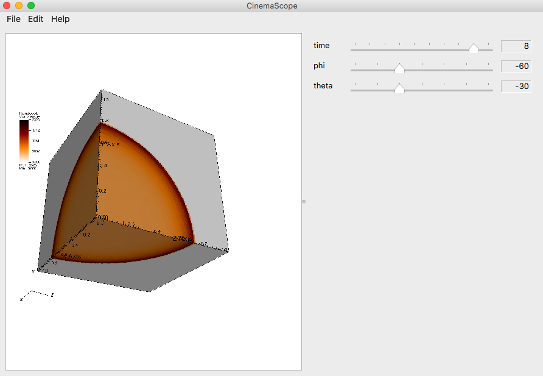

.. _label_viewers:

CinemaScience Viewers
======================

CinemaScience provides reference viewers and flexible components for users to build application specific viewers.  The basic viewers are introduced here.  A full viewer tutorial is available at  :ref:`label_tutorial_viewers`.

.. _label_cinema_compare:

Cinema:Compare
--------------

**Cinema:Compare** is an interactive visualization approach to exploring Cinema databases.  It can be used with single databases to rotate around a visualization as with the MPAS-Ocean simulation shown in :numref: 'Figure %s <fig_CompareSingle>'.

.. _fig_CompareSingle:

   An example using **Cinema:Compare** to view a single Cinema database.  This MPAS-Ocean database can be explored via sliders that range across the available parameter values.  The choice of database(s) can be changed by selecting from a drop-down menu (above sliders) defined by a JSON file.

**Cinema:Compare** can also be used to compare multiple databases as with the Warp plasma accelerator visualization, :numref: 'Figure %s <fig_CompareMultiple>' that compares different approaches to finding isocontours in the simulation.

.. _fig_CompareMultiple:

   A comparison of two Warp plasma accelerator simulations.  In the one on the left, a data-driven topological analysis selects important isocontours.  On the right, regularly space isocontours are used.  The time/phi/theta sliders can be used to explore the differences spatially and temporally.

The list of databases available in the viewer is controlled via a databases.json file in the cinema_compare/data directory.  The sets of single or multiple databases are defined in the databases.json file and appear as a list in the dropdown menu above the control sliders.  Titles can also be specified for the each Cinema database in the comparison view.  Cinema:Compare can be found at `cinema_compare`_ and its tutorial is at  :ref:`label_tutorial_compare`.

.. _label_cinema_explorer:

Cinema:Explorer
---------------

**Cinema:Explorer** is a browser based viewer for Spec D databases.  It includes a parallel coordinates plot and a scatterplot view. The columns are the data artifacts or derived quantities that are defined in the data.csv file for the Spec D database.  :numref: 'Figure %s <fig_NyxExplorer>' shows the baryon density from a Nyx cosmological simulation.  Note how one can choose a subset of the images to view by selecting a region along one of the variable axes.  The parallel coordinates view supports linking and brushing allowing the user to query a subset of the data and view the resultant set of images.

.. _fig_NyxExplorer:

    A large Nyx cosmological simulation is viewed within **Cinema:Explorer**.  The database has had a series of computer vision algorithms applied to extend the database (see :ref:`label_cinema_lib`).

**Cinema:Explorer** uses a similar databases.json approach to define a list of available databases which can be explored.  databases.json is located within the cinema_explorer/cinema/explorer/1.9 directory.  **Cinema:Explorer** can be found at `cinema_explorer`_ and its tutorial is at  :ref:`label_tutorial_explorer`.

.. _label_cinema_scope:

Cinema:Scope
------------

**Cinema:Scope** is a prototype cross-platform viewer application that allows the user to interactively explore a Cinema database of images, through both sliders and mouse controls.  Cinema:Scope is compatible with the CSV specification of Cinema databases.  In :numref: 'Figure %s <fig_Scope>', a Sedov blast wave is viewed with **Cinema:Scope**.  The parameters linked to the mouse controls can be changed by the user.  For databases with multiple artifacts, the image artifact can be changed by the user to change the view to a different set of images.

.. _fig_Scope:

    A Sedov blast wave is viewed within **Cinema:Scope**.  The database can be explored either through slider control or through intuitive mouse controls.

CinemaScope can be found at `cinema_scope`_ and its tutorial is at  :ref:`label_tutorial_scope`.

Other Viewers
-------------

The `CinemaScience GitHub`_ page contains other Cinema viewers and modules that provide useful examples for developers.  In particular, `cinema_components`_ provides a javascript library of components that can be used to extend CinemaExplorer or individually assembled to create an application-specific viewer (see :ref:`label_cinema_components`).

The Cinema viewer projects include:

- `cinema_components`_ A javascript library containing prebuilt components for viewing and querying Cinema CSV-based databases.
- `cinema_newsfeed`_ A pipeline approach to present analysis results to the user.
- `cinema_quest`_ An interactive visual tool for querying Cinema Database ensembles.
- `cinema_bandit`_ A multi-view application for analysis and visualization of experimental data.
- `cinema_debye_scherrer`_ An interactive web-based tool to visualize multiple datasets.
- `cinema_simpleviewers`_ A set of simple viewers to be used as examples to create custom Cinema viewers.
- `cinema_unityviewer`_ An experimental viewer based on the Unity game engine.
- `cinema_jnc`_ A prototype Jupyter notebook-based viewer.

.. _cinema_compare : https://github.com/cinemascience/cinema_compare
.. _cinema_explorer : https://github.com/cinemascience/cinema_explorer
.. _cinema_scope : https://github.com/cinemascience/cinema_scope
.. _CinemaScience GitHub : https://github.com/cinemascience
.. _cinema_components :  https://github.com/cinemascience/cinema_components
.. _cinema_newsfeed :  https://github.com/cinemascience/cinema_newsfeed
.. _cinema_quest : https://github.com/cinemascience/cinema_quest
.. _cinema_bandit : https://github.com/cinemascience/cinema_bandit
.. _cinema_debye_scherrer : https://github.com/cinemascience/cinema_debye_scherrer
.. _cinema_simpleviewers : https://github.com/cinemascience/cinema_simpleviewers
.. _cinema_unityviewer : https://github.com/cinemascience/cinema_unityviewer
.. _cinema_jnc : https://github.com/cinemascience/cinema_jnc

.. toctree::
   :maxdepth: 2
